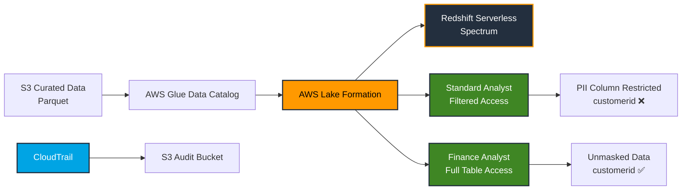

# Enterprise E-Commerce Data Lakehouse & Governance

A Terraform-managed AWS data lakehouse demonstrating **data governance, column-level security, serverless analytics, infrastructure as code, and auditability**.

The project builds an S3-based analytical data platform in which curated e-commerce data is registered with the AWS Glue Data Catalog and governed through **AWS Lake Formation**. Amazon Redshift Serverless provides the analytical query layer through Redshift Spectrum, while AWS CloudTrail provides an auditable record of infrastructure and data-access activity.

The project specifically demonstrates how the same underlying dataset can be exposed to different analytical roles with different levels of access to sensitive columns.

---

## Architecture & Data Flow



### Data Flow

1. **Curated Storage — Amazon S3**

   Processed e-commerce data is stored in Amazon S3 as Parquet files. The curated bucket serves as the governed analytical data layer.

2. **Metadata Management — AWS Glue Data Catalog**

   The curated dataset is represented as a Glue Data Catalog table, providing the schema and metadata required by downstream analytical services.

3. **Governance — AWS Lake Formation**

   The S3 location and Glue table are registered with Lake Formation. Lake Formation controls access to the cataloged data and provides fine-grained permissions.

4. **Column-Level Security — Lake Formation Data Filters**

   A Lake Formation data filter excludes the `customerid` column from the standard analyst role while allowing access to the remaining columns.

   Lake Formation supports column-, row-, and cell-level filtering through data filters, and Amazon Redshift Spectrum can enforce those filters when querying Lake Formation-managed tables.

5. **Analytical Serving — Amazon Redshift Serverless**

   Redshift Serverless exposes the governed Glue Catalog table through an external schema using Redshift Spectrum.

6. **Auditing — AWS CloudTrail**

   CloudTrail records AWS API activity associated with the environment and delivers the audit logs to a dedicated S3 bucket. Log-file validation is enabled to support integrity verification of delivered CloudTrail logs.

---

## Security Model

The project demonstrates **role-based data access with column-level restrictions**.

### Standard Analyst

The standard analytics role receives:

* Database metadata access
* Table metadata access
* Filtered `SELECT` access
* Access to all permitted columns
* **No access to `customerid`**

Example:

```sql
SELECT customerid
FROM external_ecommerce."ismael_ecommerce_processed_065320271591_us_east_1_an";
```

Expected result:

```text
Permission denied
```

The same role can query non-sensitive fields:

```sql
SELECT country
FROM external_ecommerce."ismael_ecommerce_processed_065320271591_us_east_1_an";
```

Expected result:

```text
Query succeeds
```

### Finance Analyst

The finance role receives full table access through Lake Formation and can query the restricted column:

```sql
SELECT customerid
FROM finance_ecommerce."ismael_ecommerce_processed_065320271591_us_east_1_an";
```

Expected result:

```text
Query succeeds
```

This demonstrates that access to sensitive data is controlled centrally through Lake Formation rather than by maintaining separate physical copies of the dataset.

AWS documents Lake Formation as a centralized mechanism for controlling database, table, and column-level access for services such as Amazon Redshift Spectrum.

---

## Technology Stack

| Technology                      | Purpose                                         |
| ------------------------------- | ----------------------------------------------- |
| **Terraform**                   | Infrastructure as Code                          |
| **Amazon S3**                   | Curated data lake storage                       |
| **AWS Glue Data Catalog**       | Dataset metadata and schema                     |
| **AWS Lake Formation**          | Data governance and fine-grained access control |
| **Lake Formation Data Filters** | Column-level PII restriction                    |
| **Amazon Redshift Serverless**  | Serverless analytical warehouse/query layer     |
| **Redshift Spectrum**           | Querying Glue/Lake Formation-managed S3 data    |
| **AWS IAM**                     | Service and role-based authorization            |
| **AWS CloudTrail**              | API activity and governance auditing            |
| **AWS CLI**                     | Validation and operational testing              |

---

## Infrastructure as Code

Terraform manages the core infrastructure, including:

* Lake Formation S3 resource registration
* Lake Formation LF-Tags
* Lake Formation data filters
* Lake Formation permissions
* IAM execution roles
* Redshift Serverless namespace
* Redshift Serverless workgroup
* CloudTrail trail
* Dedicated CloudTrail S3 audit bucket
* S3 security controls
* Encryption configuration

Terraform allows the architecture to be reproduced consistently rather than relying exclusively on manually configured AWS resources.

---

## Data Governance

The project uses AWS Lake Formation to establish a centralized governance layer between the physical S3 data and analytical consumers.

### LF-Tags

The project defines LF-Tags for:

```text
department
├── analytics
└── finance

sensitivity
├── restricted
└── public
```

The curated table is tagged as:

```text
department = analytics
sensitivity = restricted
```

This demonstrates the foundation for extending the architecture toward attribute-based access control as the number of datasets and organizational roles grows.

---

## Data Quality Checks

The Redshift external table is also used to perform analytical data-quality checks.

### Completeness

Checks for missing critical attributes:

```sql
WHERE invoiceno IS NULL
   OR stockcode IS NULL
   OR quantity IS NULL
   OR unitprice IS NULL;
```

### Validity

Checks for invalid quantities and prices:

```sql
WHERE quantity <= 0
   OR unitprice < 0;
```

### Business Rule Integrity

Validates calculated revenue:

```sql
MIN(quantity * unitprice)
```

### Volume & Uniqueness

Measures:

```sql
COUNT(*)
COUNT(DISTINCT invoiceno)
```

These checks provide a basic data-quality validation layer on top of the governed analytical dataset.

---

## Analytical Query Example

The project supports analytical queries directly against the S3-backed external table.

Example: revenue by country:

```sql
SELECT
    country,
    COUNT(DISTINCT invoiceno) AS total_orders,
    SUM(quantity * unitprice) AS total_revenue
FROM external_ecommerce."ismael_ecommerce_processed_065320271591_us_east_1_an"
GROUP BY 1
HAVING SUM(quantity * unitprice) IS NOT NULL
ORDER BY total_revenue DESC
LIMIT 10;
```

This demonstrates querying curated Parquet data through Redshift Spectrum without requiring a separate physical copy of the dataset inside Redshift.

---

## Audit & Security

AWS CloudTrail is configured with:

* Dedicated S3 audit bucket
* S3 public-access blocking
* Server-side encryption
* CloudTrail log-file validation
* Multi-region trail
* Global service event capture
* CloudTrail-specific S3 bucket policy

CloudTrail log-file validation provides a mechanism to verify that delivered log files have not been modified or deleted after delivery.

---

## Engineering Highlights

### Fine-Grained Data Security

Implemented column-level access restrictions using Lake Formation data filters rather than creating separate datasets for different users.

### Infrastructure as Code

Core governance, IAM, Redshift, S3, and CloudTrail infrastructure is defined through Terraform.

### Serverless Analytics

Uses Redshift Serverless and S3-backed external tables to provide analytical capabilities without managing traditional database servers.

### Centralized Governance

Lake Formation provides a centralized authorization layer for the Glue Data Catalog and underlying S3 data.

### Auditable Infrastructure

CloudTrail captures AWS API activity and stores audit logs separately from the analytical data.

### Role-Based Access

Demonstrates two analytical personas:

```text
Standard Analyst
    ↓
Restricted SELECT
    ↓
customerid ❌

Finance Analyst
    ↓
Full Table Access
    ↓
customerid ✅
```

---

## Project Structure

```text
enterprise-lakehouse-governance/
│
├── infrastructure/
│   ├── main.tf
│   ├── variables.tf
│   ├── outputs.tf
│   ├── iam.tf
│   ├── lakeformation.tf
│   ├── redshift.tf
│   └── audit.tf
│
├── src/
│   ├── data_quality_checks.sql
│   └── sample_queries.sql
│
├── .gitignore
├── terraform.tfvars.example
└── README.md
```

---

## Deployment

### 1. Clone the repository

```bash
git clone https://github.com/YOUR_USERNAME/enterprise-lakehouse-governance.git

cd enterprise-lakehouse-governance/infrastructure
```

### 2. Configure Terraform variables

Create a local `terraform.tfvars` file:

```hcl
redshift_admin_password = "YOUR_SECURE_PASSWORD"
```

**Do not commit `terraform.tfvars` to Git.**

The repository includes a `terraform.tfvars.example` file for configuration reference.

### 3. Initialize Terraform

```bash
terraform init
```

### 4. Review the infrastructure plan

```bash
terraform plan
```

### 5. Deploy

```bash
terraform apply
```

---

## Validation

After deployment, validate the environment by:

1. Confirming the curated S3 location is registered with Lake Formation.
2. Confirming the Glue Catalog table is available.
3. Creating/querying the Redshift external schema.
4. Running the analytical queries.
5. Running the data-quality checks.
6. Testing standard analyst access to permitted columns.
7. Confirming standard analyst access to `customerid` is denied.
8. Testing finance analyst access to `customerid`.
9. Confirming CloudTrail is delivering logs to the audit bucket.

---

## Design Considerations

This is a **portfolio/demo implementation modeled on enterprise data-platform patterns**, rather than a production deployment.

For a production environment, additional hardening would include:

* Private Redshift networking
* VPC endpoints / controlled network paths
* More restrictive IAM policies
* Secrets Manager or managed Redshift credentials
* S3 versioning and retention controls for audit logs
* Centralized logging/monitoring
* Environment-specific Terraform configurations
* CI/CD with automated Terraform validation
* Remote Terraform state with locking
* Additional Lake Formation governance policies

The project intentionally focuses on demonstrating the core architecture and governance concepts while keeping the environment practical to deploy and test.

---

## Key Takeaways

This project demonstrates practical experience with:

* **AWS Data Engineering**
* **Terraform / Infrastructure as Code**
* **Amazon S3**
* **AWS Glue Data Catalog**
* **AWS Lake Formation**
* **Lake Formation data filtering**
* **Amazon Redshift Serverless**
* **Redshift Spectrum**
* **IAM**
* **AWS CloudTrail**
* **SQL data quality**
* **Data governance**
* **Column-level security**
* **Serverless analytics**

The central engineering objective is to demonstrate how a cloud data platform can provide **scalable analytical access while enforcing different levels of data visibility for different organizational roles**.
=======
# Enterprise E-Commerce Data Lakehouse & Governance

A Terraform-managed AWS data lakehouse demonstrating **data governance, column-level security, serverless analytics, infrastructure as code, and auditability**.

The project builds an S3-based analytical data platform in which curated e-commerce data is registered with the AWS Glue Data Catalog and governed through **AWS Lake Formation**. Amazon Redshift Serverless provides the analytical query layer through Redshift Spectrum, while AWS CloudTrail provides an auditable record of infrastructure and data-access activity.

The project specifically demonstrates how the same underlying dataset can be exposed to different analytical roles with different levels of access to sensitive columns.

---

## Architecture & Data Flow


### Data Flow

1. **Curated Storage — Amazon S3**

   Processed e-commerce data is stored in Amazon S3 as Parquet files. The curated bucket serves as the governed analytical data layer.

2. **Metadata Management — AWS Glue Data Catalog**

   The curated dataset is represented as a Glue Data Catalog table, providing the schema and metadata required by downstream analytical services.

3. **Governance — AWS Lake Formation**

   The S3 location and Glue table are registered with Lake Formation. Lake Formation controls access to the cataloged data and provides fine-grained permissions.

4. **Column-Level Security — Lake Formation Data Filters**

   A Lake Formation data filter excludes the `customerid` column from the standard analyst role while allowing access to the remaining columns.

   Lake Formation supports column-, row-, and cell-level filtering through data filters, and Amazon Redshift Spectrum can enforce those filters when querying Lake Formation-managed tables.

5. **Analytical Serving — Amazon Redshift Serverless**

   Redshift Serverless exposes the governed Glue Catalog table through an external schema using Redshift Spectrum.

6. **Auditing — AWS CloudTrail**

   CloudTrail records AWS API activity associated with the environment and delivers the audit logs to a dedicated S3 bucket. Log-file validation is enabled to support integrity verification of delivered CloudTrail logs.

---

## Security Model

The project demonstrates **role-based data access with column-level restrictions**.

### Standard Analyst

The standard analytics role receives:

* Database metadata access
* Table metadata access
* Filtered `SELECT` access
* Access to all permitted columns
* **No access to `customerid`**

Example:

```sql
SELECT customerid
FROM external_ecommerce."ismael_ecommerce_processed_065320271591_us_east_1_an";
```

Expected result:

```text
Permission denied
```

The same role can query non-sensitive fields:

```sql
SELECT country
FROM external_ecommerce."ismael_ecommerce_processed_065320271591_us_east_1_an";
```

Expected result:

```text
Query succeeds
```

### Finance Analyst

The finance role receives full table access through Lake Formation and can query the restricted column:

```sql
SELECT customerid
FROM finance_ecommerce."ismael_ecommerce_processed_065320271591_us_east_1_an";
```

Expected result:

```text
Query succeeds
```

This demonstrates that access to sensitive data is controlled centrally through Lake Formation rather than by maintaining separate physical copies of the dataset.

AWS documents Lake Formation as a centralized mechanism for controlling database, table, and column-level access for services such as Amazon Redshift Spectrum.

---

## Technology Stack

| Technology                      | Purpose                                         |
| ------------------------------- | ----------------------------------------------- |
| **Terraform**                   | Infrastructure as Code                          |
| **Amazon S3**                   | Curated data lake storage                       |
| **AWS Glue Data Catalog**       | Dataset metadata and schema                     |
| **AWS Lake Formation**          | Data governance and fine-grained access control |
| **Lake Formation Data Filters** | Column-level PII restriction                    |
| **Amazon Redshift Serverless**  | Serverless analytical warehouse/query layer     |
| **Redshift Spectrum**           | Querying Glue/Lake Formation-managed S3 data    |
| **AWS IAM**                     | Service and role-based authorization            |
| **AWS CloudTrail**              | API activity and governance auditing            |
| **AWS CLI**                     | Validation and operational testing              |

---

## Infrastructure as Code

Terraform manages the core infrastructure, including:

* Lake Formation S3 resource registration
* Lake Formation LF-Tags
* Lake Formation data filters
* Lake Formation permissions
* IAM execution roles
* Redshift Serverless namespace
* Redshift Serverless workgroup
* CloudTrail trail
* Dedicated CloudTrail S3 audit bucket
* S3 security controls
* Encryption configuration

Terraform allows the architecture to be reproduced consistently rather than relying exclusively on manually configured AWS resources.

---

## Data Governance

The project uses AWS Lake Formation to establish a centralized governance layer between the physical S3 data and analytical consumers.

### LF-Tags

The project defines LF-Tags for:

```text
department
├── analytics
└── finance

sensitivity
├── restricted
└── public
```

The curated table is tagged as:

```text
department = analytics
sensitivity = restricted
```

This demonstrates the foundation for extending the architecture toward attribute-based access control as the number of datasets and organizational roles grows.

---

## Data Quality Checks

The Redshift external table is also used to perform analytical data-quality checks.

### Completeness

Checks for missing critical attributes:

```sql
WHERE invoiceno IS NULL
   OR stockcode IS NULL
   OR quantity IS NULL
   OR unitprice IS NULL;
```

### Validity

Checks for invalid quantities and prices:

```sql
WHERE quantity <= 0
   OR unitprice < 0;
```

### Business Rule Integrity

Validates calculated revenue:

```sql
MIN(quantity * unitprice)
```

### Volume & Uniqueness

Measures:

```sql
COUNT(*)
COUNT(DISTINCT invoiceno)
```

These checks provide a basic data-quality validation layer on top of the governed analytical dataset.

---

## Analytical Query Example

The project supports analytical queries directly against the S3-backed external table.

Example: revenue by country:

```sql
SELECT
    country,
    COUNT(DISTINCT invoiceno) AS total_orders,
    SUM(quantity * unitprice) AS total_revenue
FROM external_ecommerce."ismael_ecommerce_processed_065320271591_us_east_1_an"
GROUP BY 1
HAVING SUM(quantity * unitprice) IS NOT NULL
ORDER BY total_revenue DESC
LIMIT 10;
```

This demonstrates querying curated Parquet data through Redshift Spectrum without requiring a separate physical copy of the dataset inside Redshift.

---

## Audit & Security

AWS CloudTrail is configured with:

* Dedicated S3 audit bucket
* S3 public-access blocking
* Server-side encryption
* CloudTrail log-file validation
* Multi-region trail
* Global service event capture
* CloudTrail-specific S3 bucket policy

CloudTrail log-file validation provides a mechanism to verify that delivered log files have not been modified or deleted after delivery.

---

## Engineering Highlights

### Fine-Grained Data Security

Implemented column-level access restrictions using Lake Formation data filters rather than creating separate datasets for different users.

### Infrastructure as Code

Core governance, IAM, Redshift, S3, and CloudTrail infrastructure is defined through Terraform.

### Serverless Analytics

Uses Redshift Serverless and S3-backed external tables to provide analytical capabilities without managing traditional database servers.

### Centralized Governance

Lake Formation provides a centralized authorization layer for the Glue Data Catalog and underlying S3 data.

### Auditable Infrastructure

CloudTrail captures AWS API activity and stores audit logs separately from the analytical data.

### Role-Based Access

Demonstrates two analytical personas:

```text
Standard Analyst
    ↓
Restricted SELECT
    ↓
customerid ❌

Finance Analyst
    ↓
Full Table Access
    ↓
customerid ✅
```

---

## Project Structure

```text
enterprise-lakehouse-governance/
│
├── infrastructure/
│   ├── main.tf
│   ├── variables.tf
│   ├── outputs.tf
│   ├── iam.tf
│   ├── lakeformation.tf
│   ├── redshift.tf
│   └── audit.tf
│
├── src/
│   ├── data_quality_checks.sql
│   └── sample_queries.sql
│
├── .gitignore
├── terraform.tfvars.example
└── README.md
```

---

## Deployment

### 1. Clone the repository

```bash
git clone https://github.com/YOUR_USERNAME/enterprise-lakehouse-governance.git

cd enterprise-lakehouse-governance/infrastructure
```

### 2. Configure Terraform variables

Create a local `terraform.tfvars` file:

```hcl
redshift_admin_password = "YOUR_SECURE_PASSWORD"
```

**Do not commit `terraform.tfvars` to Git.**

The repository includes a `terraform.tfvars.example` file for configuration reference.

### 3. Initialize Terraform

```bash
terraform init
```

### 4. Review the infrastructure plan

```bash
terraform plan
```

### 5. Deploy

```bash
terraform apply
```

---

## Validation

After deployment, validate the environment by:

1. Confirming the curated S3 location is registered with Lake Formation.
2. Confirming the Glue Catalog table is available.
3. Creating/querying the Redshift external schema.
4. Running the analytical queries.
5. Running the data-quality checks.
6. Testing standard analyst access to permitted columns.
7. Confirming standard analyst access to `customerid` is denied.
8. Testing finance analyst access to `customerid`.
9. Confirming CloudTrail is delivering logs to the audit bucket.

---

## Design Considerations

This is a **portfolio/demo implementation modeled on enterprise data-platform patterns**, rather than a production deployment.

For a production environment, additional hardening would include:

* Private Redshift networking
* VPC endpoints / controlled network paths
* More restrictive IAM policies
* Secrets Manager or managed Redshift credentials
* S3 versioning and retention controls for audit logs
* Centralized logging/monitoring
* Environment-specific Terraform configurations
* CI/CD with automated Terraform validation
* Remote Terraform state with locking
* Additional Lake Formation governance policies

The project intentionally focuses on demonstrating the core architecture and governance concepts while keeping the environment practical to deploy and test.

---

## Key Takeaways

This project demonstrates practical experience with:

* **AWS Data Engineering**
* **Terraform / Infrastructure as Code**
* **Amazon S3**
* **AWS Glue Data Catalog**
* **AWS Lake Formation**
* **Lake Formation data filtering**
* **Amazon Redshift Serverless**
* **Redshift Spectrum**
* **IAM**
* **AWS CloudTrail**
* **SQL data quality**
* **Data governance**
* **Column-level security**
* **Serverless analytics**

The central engineering objective is to demonstrate how a cloud data platform can provide **scalable analytical access while enforcing different levels of data visibility for different organizational roles**.
>>>>>>> 51b372f1825fe4fd6dad12d133268d8c9ff99942
